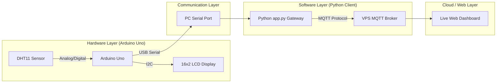

# 🌡️ Temperature Monitor & Cloud MQTT Integration System

An integrated embedded architecture designed for real-time thermal telemetry monitoring. The system captures temperature data via hardware, displays it locally with dynamic scrolling text, and pipes metrics over a USB serial link to a PC-side gateway that publishes to a cloud-based MQTT broker.

---

### 🚀 Submission Details
*   **Student Name**: IGITANGAZA
*   **Live Dashboard**: [http://157.173.101.159:8052/dashboard.html](http://157.173.101.159:8052/dashboard.html)
*   **Repository**: [https://github.com/IGITANGAZA23/temperature-mqtt-monitor](https://github.com/IGITANGAZA23/temperature-mqtt-monitor)

---

## 🏗️ System Architecture Diagram



## 📋 Features
* **Real-time Monitoring**: Periodic DHT11 temperature sampling.
* **Smart Display**: 16x2 LCD with automatic horizontal scrolling for name display.
* **Cloud Integration**: Uplink to a custom VPS Broker (`157.173.101.159`) via MQTT.
* **Local Terminal**: PC-side real-time monitoring of incoming metrics.
* **Web Deployment**: Background-hosted dashboard using `nohup` and Python HTTP server.

## 🛠️ Setup Instructions

### 1. Hardware Wiring
* **DHT11 Sensor**: `VCC` -> 5V, `GND` -> GND, `DATA` -> **Pin 2**
* **I2C LCD**: `VCC` -> 5V, `GND` -> GND, `SDA` -> **Pin A4**, `SCL` -> **Pin A5**

### 2. Software Dependencies
Ensure you have Python 3.x installed.
```bash
pip install -r pc_client/requirements.txt
```

### 3. Hardware Deployment
1. Open `hardware/src.ino` in the Arduino IDE.
2. Update the `candidateName` variable.
3. Upload to Arduino Uno.

### 4. Running the PC Client (Gateway)
1. Set `SERIAL_PORT` in `pc_client/app.py`.
2. Run: `python pc_client/app.py`

### 5. VPS Deployment (Frontend)
1. Upload `dashboard.html` to VPS.
2. Run background server:
   ```bash
   nohup python3 -m http.server 8052 &
   ```

## 📸 Project Showcase

### 1. Hardware Working & Wiring


### 2. LCD Initialization & Temperature Display


### 3. Final Deployment: Real-time VPS Monitoring


## 📡 Communication Details
*   **Serial Interface**: `COM7`, `9600 bps`
*   **MQTT Broker**: `157.173.101.159` (VPS)
*   **MQTT Port**: `1883` (Default), `9001` (WebSockets)
*   **Topic**: `igitangaza/temperature`

## 📊 Live Monitoring Dashboard
The project includes a web-based dashboard for remote metric visualization.
*   **Live Link**: [http://157.173.101.159:8052/dashboard.html](http://157.173.101.159:8052/dashboard.html)
*   **Dashboard Stack**: HTML5, Vanilla CSS3, MQTT.js (WebSockets protocol).


## 📂 Project Structure
```
📦 temperature-mqtt-monitor
 ┣ 📂 hardware
 ┃ ┗ 📜 src.ino          # Arduino firmware (C++)
 ┣ 📂 pc_client
 ┃ ┣ 📜 app.py           # PC-side gateway (Python)
 ┃ ┣ 📜 dashboard.html   # Web-based frontend
 ┃ ┗ 📜 requirements.txt # Python dependencies
 ┣ 📂 screenshots        # Project visualization
 ┗ 📜 README.md          # Documentation
```
