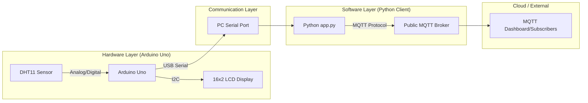

# Temperature Monitor & Cloud MQTT Integration System

An integrated embedded architecture designed for real-time thermal telemetry monitoring. The system captures temperature data via hardware, displays it locally with dynamic scrolling text, and pipes metrics over a USB serial link to a PC-side gateway that publishes to a cloud-based MQTT broker.

## 🏗️ System Architecture Diagram



## 📋 Features
* **Real-time Monitoring**: Periodic DHT11 temperature sampling.
* **Smart Display**: 16x2 LCD with automatic horizontal scrolling for long candidate names.
* **Cloud Integration**: Uplink to `broker.hivemq.com` (or custom VPS) via MQTT.
* **Local Terminal**: PC-side real-time monitoring of incoming metrics.

## 🛠️ Setup Instructions

### 1. Hardware Wiring
* **DHT11 Sensor**: 
    * `VCC` -> 5V
    * `GND` -> GND
    * `DATA` -> **Pin 2**
* **I2C LCD**:
    * `VCC` -> 5V
    * `GND` -> GND
    * `SDA` -> **Pin A4**
    * `SCL` -> **Pin A5**

### 2. Software Dependencies
Ensure you have Python 3.x installed. Navigate to the `pc_client` directory and install required modules:
```bash
pip install -r pc_client/requirements.txt
```

### 3. Hardware Deployment
1. Open `hardware/src.ino` in the Arduino IDE.
2. Update the `candidateName` variable with your full name.
3. Select your Board (Arduino Uno) and Port.
4. Click **Upload**.

### 4. Running the PC Client
1. Identify your Arduino's COM port (e.g., `COM3`, `COM7`).
2. Open `pc_client/app.py` and set `SERIAL_PORT = 'YOUR_COM_PORT'`.
3. Run the script:
```bash
python pc_client/app.py
```

## 📸 Screenshots
### 1. Hardware Initialization & Temperature Display


### 2. PC Monitoring & MQTT Transmission


## 📡 Communication Details
*   **Serial Interface**: 
    *   **Port**: `COM7` (Arduino Uno)
    *   **Baud Rate**: `9600 bps`
*   **MQTT Configuration**:
    *   **Broker**: `157.173.101.159` (VPS)
    *   **Port**: `1883`
    *   **Topic**: `igitangaza/temperature`


## 📂 Project Structure
```
📦 temperature-mqtt-monitor
 ┣ 📂 hardware
 ┃ ┗ 📜 src.ino          # Arduino firmware (C++)
 ┗ 📂 pc_client
 ┃ ┣ 📜 app.py           # PC-side gateway (Python)
 ┃ ┗ 📜 requirements.txt # Python dependencies
 ┣ 📜 README.md          # Documentation
```
